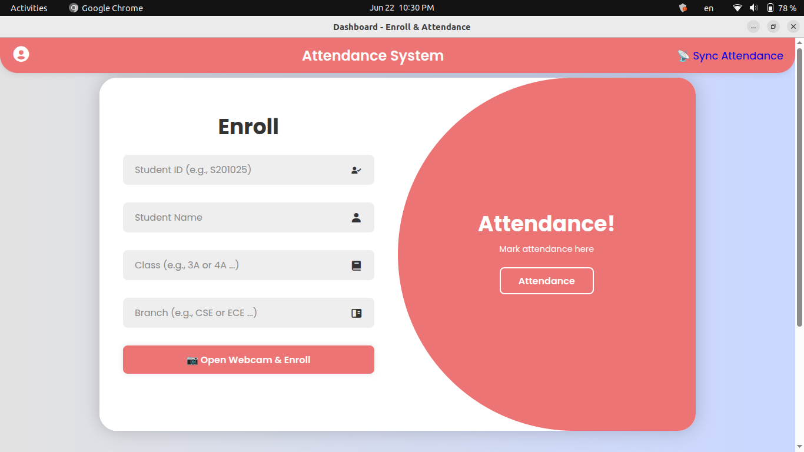
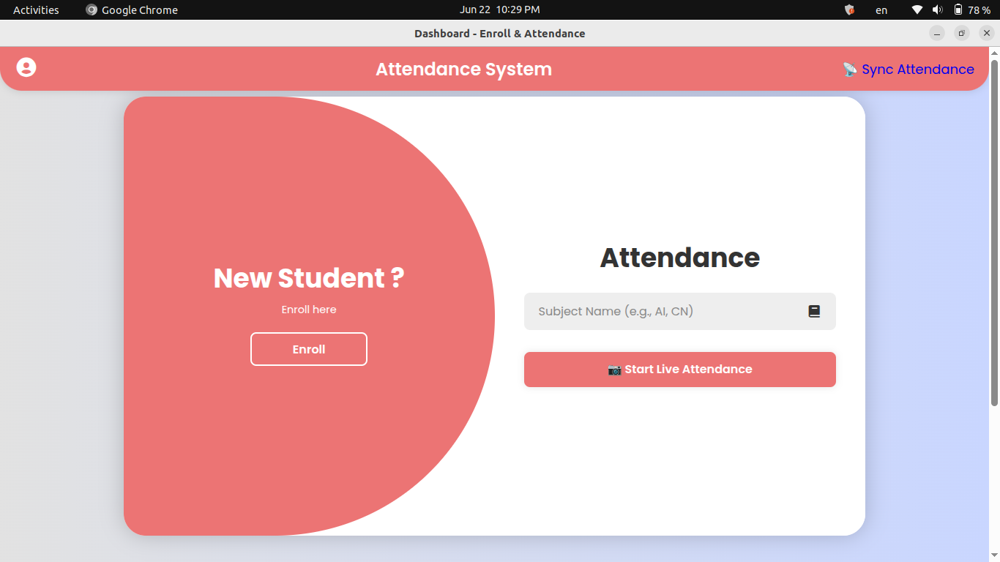

# 🎓 Smart Face Recognition Attendance System

An intelligent desktop application built with **Flask**, **YOLOv8**, and **face recognition** to automate student attendance using live camera input. It supports enrollment, attendance marking, real-time recognition, and attendance analytics with filtering, syncing, and exporting.

---

## 🚀 Features

- 👤 **Student Enrollment** with face capture via webcam
- 🎥 **Live Attendance Detection** using face recognition
- 🗓️ Tracks attendance by **subject** and **timestamp**
- 📊 **Query Assistant** using Gemini + Streamlit (natural language SQL)
- ✅ Syncs attendance logs to structured SQLite database
- 📤 Export data as CSV for analysis
- 🎨 Intuitive GUI (no browser required using `flaskwebgui`)
- 🔒 Local-first — works fully offline

---

## 🖼️ Screenshots





---

## 🛠️ Technologies Used

- Python 3.10+
- Flask (backend)
- OpenCV (`cv2`) for video capture
- `face_recognition` (dlib)
- YOLOv8 (`ultralytics`) for face detection
- SQLite3 for DB
- Streamlit + Gemini AI for SQL Query Assistant
- PyInstaller + FlaskWebGUI for desktop packaging

---

## 💻 Installation (Developer Mode)

### 📦 Prerequisites

- Python 3.10+
- `pip` installed
- Webcam attached
- Optional: Google Gemini API Key for query tool

### 📁 Clone the repo

```bash
git clone https://github.com/phani-kumar-sajja/Smart-Face-Recognition-Attendance-System.git
cd face-attendance-system
